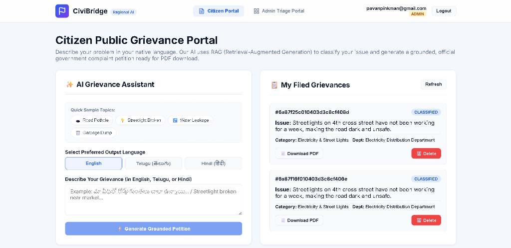
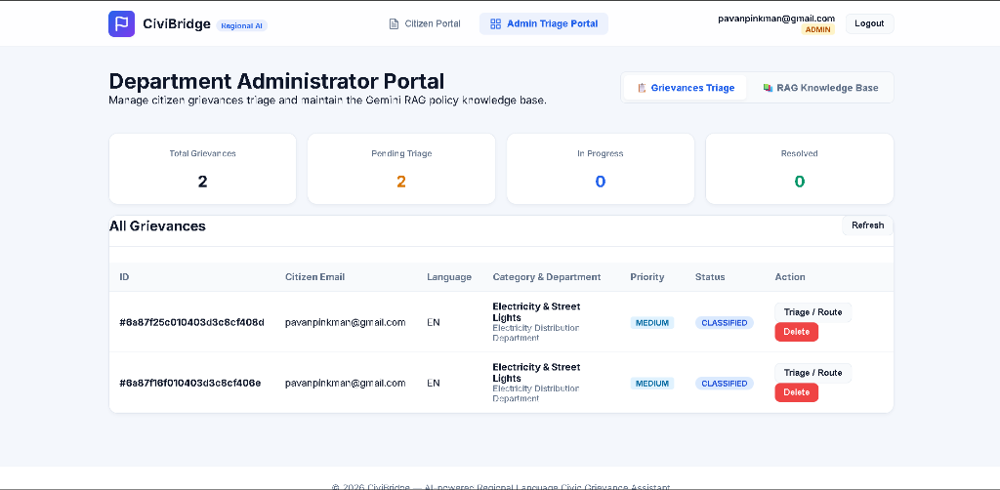
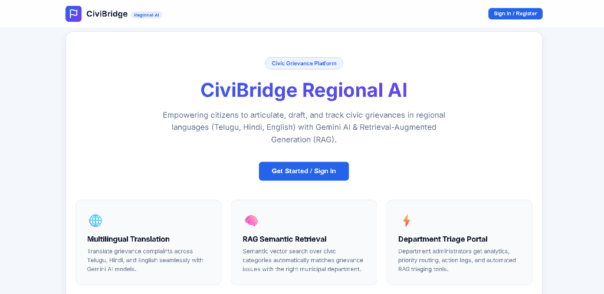
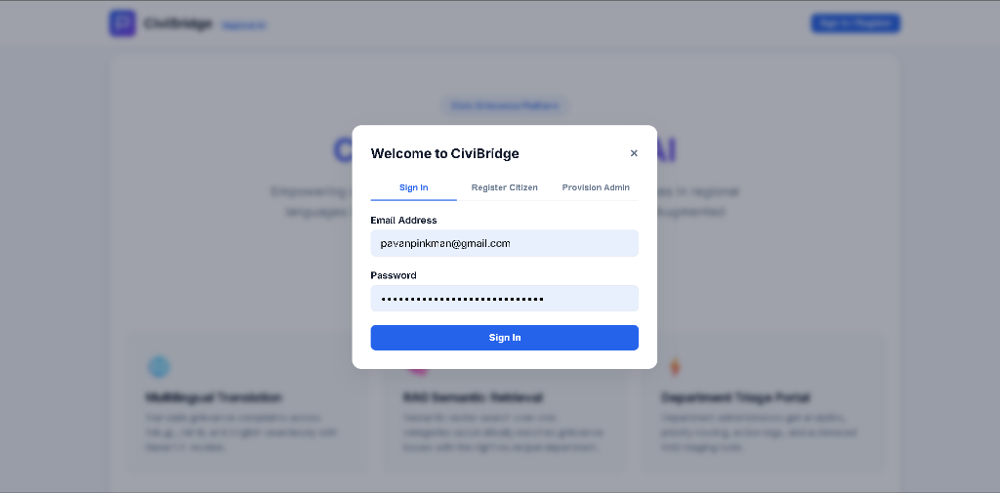

# CiviBridge — Regional Language Civic Grievance Assistant

CiviBridge is an AI-powered full-stack Web application built with **React, Node.js (Express), MongoDB Atlas, and Google Gemini AI**. It empowers citizens to file civic grievances in their native regional languages (Telugu, Hindi, English) and uses **Retrieval-Augmented Generation (RAG)** to classify, ground, and generate official government petition documents ready for PDF export.

---

## 📸 Application Screenshots

### 1. Citizen Public Grievance Portal


### 2. Department Administrator Triage Portal


### 3. Landing Page Overview


### 4. Authentication Modal


---

## 🚀 Key Features

### Citizen Portal
- **Multilingual Input**: Citizens describe their problem in English, Telugu, or Hindi.
- **RAG Classification & Grounding**:
  1. Text embedding vector is generated using Gemini (`text-embedding-004`).
  2. **Dual Retrieval**: Query vector is compared via **Cosine Similarity** against MongoDB Atlas vector collections:
     - `GrievanceCategory` embeddings (finds matching municipal department).
     - `KnowledgeDoc` embeddings (retrieves government rules & petition guidelines).
  3. **Augment & Generate**: Gemini LLM drafts a formal, structured petition in the user's requested language.
- **1-Page Official PDF Export**: Citizens can preview and download a formatted official letterhead petition PDF (`html2pdf.js`).
- **Grievance Tracking & Deletion**: Citizens can track status updates and delete their submitted grievances.

### Department Admin Portal
- **Grievance Triage Table**: View overview statistics (Total, Pending, In Progress, Resolved), filter complaints, run AI vector auto-routing, change status/priority, and log inspection notes.
- **RAG Knowledge Base Management**: Admin can add, update, or delete government policy documents. Any document added is automatically embedded via Gemini API and stored in MongoDB to ground future complaint generation.

---

## 🏗️ System Architecture & RAG Flow

```
┌─────────────────────────────────────────────────────────────┐
│                    RAG PIPELINE FLOW                        │
├─────────────────────────────────────────────────────────────┤
│                                                             │
│  1. EMBED (Gemini API)                                      │
│     User input text  ─────────►  768-dim Vector             │
│                                                             │
│  2. RETRIEVE (MongoDB Vector Search)                        │
│     Vector  ──► Cosine Similarity against MongoDB Docs:     │
│                 • GrievanceCategories  (Dept Routing)       │
│                 • KnowledgeDocs        (Grounding Rules)    │
│                                                             │
│  3. AUGMENT (Prompt Construction)                           │
│     System Prompt + Retrieved Context + Citizen Input      │
│                                                             │
│  4. GENERATE (Gemini LLM)                                   │
│     Output: Formal Grounded Grievance Petition             │
│                                                             │
└─────────────────────────────────────────────────────────────┘
```

---

## 📁 Directory Structure

```
CiviBridge/
├── render.yaml           # Backend deployment manifest for Render
├── README.md             # Project presentation & documentation
├── package.json          # Root launch controller
├── screenshots/          # UI application screenshots
│
├── client/               # React + Vite Frontend
│   ├── index.html        # html2pdf.js loaded for client-side PDF downloads
│   ├── vercel.json       # Vercel deployment config
│   └── src/
│       ├── components/   # CitizenPortal, AdminDashboard, Navbar, AuthModal
│       ├── context/      # AuthContext
│       └── services/     # api.js API fetch wrapper
│
└── server/               # Node.js + Express Backend
    ├── db.js             # MongoDB Mongoose connection helper
    ├── seed.js           # Seeds categories & knowledge base with embeddings
    ├── index.js          # Express server entry point
    ├── models/           # User, Complaint, GrievanceCategory, KnowledgeDoc
    ├── middleware/       # Auth & Admin check middleware
    ├── routes/           # auth, complaints, rag, translate, knowledge
    └── rag/              # embeddings.js, vectorStore.js, ragService.js
```

---

## 🛠️ Setup & Running Locally

### Prerequisites
- Node.js (v18 or v20+)
- MongoDB Atlas cluster URL
- Google Gemini API Key

### 1. Environment Configuration
Create `.env` file in the root directory:
```env
PORT=5000
MONGODB_URI="your_mongodb_atlas_uri"
JWT_SECRET="civibridge_secret_key"
GEMINI_API_KEY="your_gemini_api_key"
ADMIN_PROVISION_SECRET="civibridge-admin-secret-2026"
```

### 2. Install Dependencies & Seed Database
```bash
# Install root, server, and client dependencies
cd server && npm install
cd ../client && npm install
cd ..

# Seed MongoDB Atlas with grievance categories and knowledge base docs
npm run seed
```

### 3. Run Development Servers
```bash
# Terminal 1: Run Backend API Server
npm run dev:server

# Terminal 2: Run Frontend Client
npm run dev:client
```
Client runs on `http://localhost:3000`, Backend API runs on `http://localhost:5000`.
